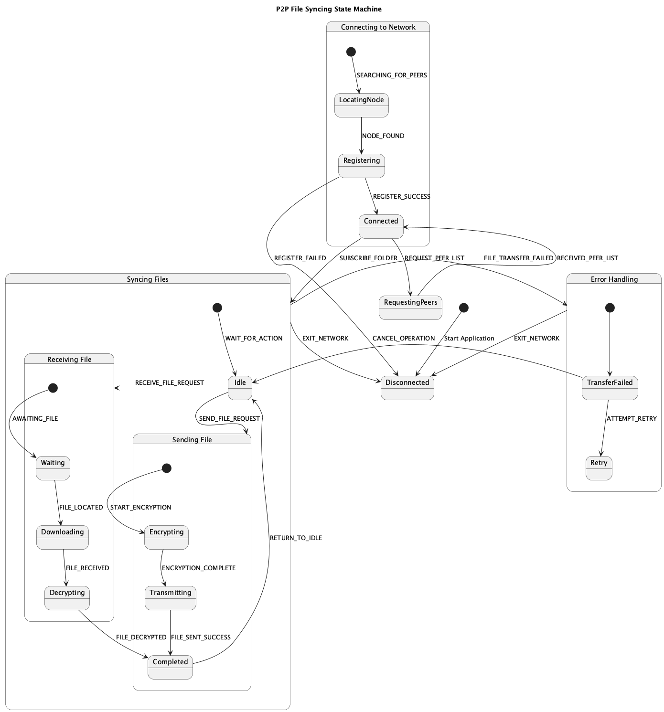

# Peer-to-Peer File Sharing System

This project is a peer-to-peer (P2P) system built in Python that allows devices to connect, recognize each other, and eventually share files directly — no central server required.

We’re building it piece by piece with the goal of having a fully functioning, secure, and efficient file-sharing network by the end of the project.

---

## What It Does (Right Now)

- Devices can connect to a central node (server) to register their presence
- The server keeps track of all active peers
- New peers receive a list of connected devices
- A detailed README (this file) explains how to run and understand the system

---

## How It Works

- A device sends a POST request to the server at `/register` with a unique `device_id`
- If the ID isn’t already in the peer table, the server adds it
- The server then responds with the current list of connected peers

---

## How to Run It

1. Open GitHub Codespaces or your terminal.
2. Run the server:
   ```bash
   python server.py
Open a new terminal tab and run the client:

bash
Copy
Edit
python device.py
To test with more devices:

Change the device_id in device.py

Run it again to simulate another peer

Example Output
json
Copy
Edit
{
  "message": "Device registered successfully.",
  "peers": ["device_001", "device_002"]
}
Tech Stack
Python 3

Flask

Requests
 Project User Stories
We’re building the project based on these 10 user stories. The goal is to fully implement each one by the time the project is complete:

As a user, I want to send and receive files over the P2P network seamlessly
→ File transfers should happen directly between devices with no central server.

As a user, I want to receive an error alert/message when a file transfer fails
→ The system should handle errors and let the user know immediately.

As a user, I want my files to be encrypted before they are transmitted
→ Files should be secure, and only the intended peer should be able to decrypt.

As a user, I want to connect to the server in order to be seen by other users
→ Devices can register with the server and get the full list of online peers.

As a user, I want to be able to see users that are currently connected to the server
→ Peers should be able to request the list at any time.

As a user, I want to authenticate other users so only trusted users can sync
→ Add security through a public/private key exchange system.

As a user, I want to log file changes to track updates from peers
→ Any time a file is created, edited, or deleted, the system should log it.

As a user, I want to receive a notification when a file has been shared or updated
→ Peers should get real-time alerts when shared content changes.

As a developer, I want to choose the communication protocol (TCP, UDP, or QUIC)
→ The network should support protocol selection based on speed/reliability.

As a user, I want to access a README file that explains how to use the system
→ This file serves that purpose — it breaks everything down clearly.

 What’s Next
Add encryption + file transfer functionality

Store peer data persistently (instead of just in memory)

Build a UI or command-line interaction system

Improve error handling and add real-time updates


P2P FSM Diagram
