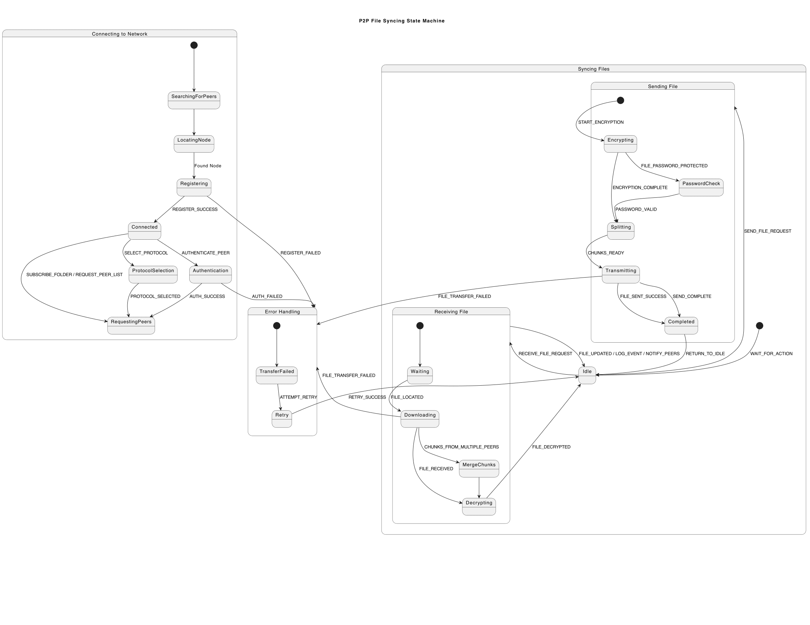

# Secure P2P File Sharing System  
**Direct device-to-device file transfers with end-to-end encryption**  

##  Quick Start  
1. Install:  
```bash  
git clone https://github.com/MikeTabbi/Comp-Network-Group-6.git
cd Comp-Network-Group-6 
pip install cryptography
```  
Start a peer:


```bash
python P2PDraft.py  
# Enter a unique peer ID when prompted 
```  
First-time setup:

```bash
trust friend_peer_id friend_public_key.pem  # Add trusted peer  
lock secret_file.txt myPassword123!         # Password-protect file
```
Share files:
```bash
get 192.168.1.15 friend_peer_id secret_file.txt  # Download from peer  
```

Requests
```
 Project User Stories
We’re building the project based on these 10 user stories. The goal is to fully implement each one by the time the project is complete:

As a user, I want to send and receive files over the P2P network seamlessly
→ File transfers should happen directly between devices with no central server.

As a user, I want to receive an error alert/message when a file transfer fails
→ The system should handle errors and let the user know immediately.

As a user, I want my files to be encrypted before they are transmitted
→ Files should be secure, and only the intended peer should be able to decrypt.

As a user, I want to connect to the server in order to be seen by other users
→ Devices can register with the server and get the full list of online peers.

As a user, I want to be able to see users that are currently connected to the server
→ Peers should be able to request the list at any time.

As a user, I want to authenticate other users so only trusted users can sync
→ Add security through a public/private key exchange system.

As a user, I want to log file changes to track updates from peers
→ Any time a file is created, edited, or deleted, the system should log it.

As a user, I want to receive a notification when a file has been shared or updated
→ Peers should get real-time alerts when shared content changes.

As a developer, I want to choose the communication protocol (TCP, UDP, or QUIC)
→ The network should support protocol selection based on speed/reliability.

As a user, I want to access a README file that explains how to use the system
→ This file serves that purpose — it breaks everything down clearly.

 What’s Next
Add encryption + file transfer functionality

Store peer data persistently (instead of just in memory)

Build a UI or command-line interaction system

Improve error handling and add real-time updates

```


P2P FSM Diagram

